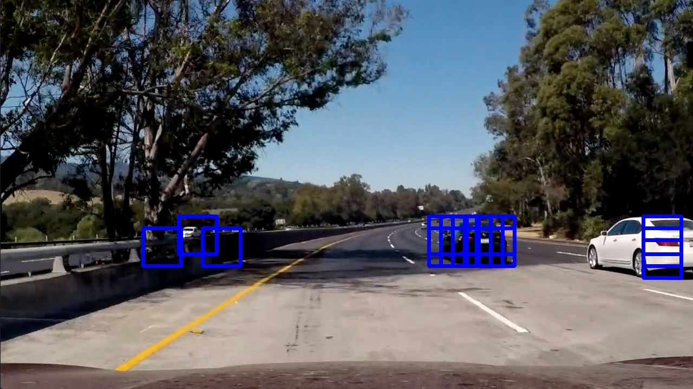

## Vehicle Detection

Overview:
---
Project #5 from the Udacity Self-Driving Car program (SDC).
This project uses a set of images (vehicles and non-vehicles) to train a Classifier (Support Vector Machine)
to identify and recognize cars in a road video. Image data such as color histograms and hog features are used for better accuracy.
Other advanced image processing techniques such as heat maps are used for increased robustness.

Tools and Techniques:
---
* Implemented in Python
* OpenCV
* Machine learning (Support Vector Machine classifier)
* Color histograms and HOG feature extraction

Reflections:
---
The results of my tests show that cars too close to the edges (only partially visible) are particularly challenging 
to detect since its shape is not completely within range. White vehicles also pose a challenge with traditional
RGB histograms, other color spectrums are of good use in this case.
Finally, the classifier was trained using images of mid size sedan-like cars, it is easy to predict that the classifier may fail to detect large vehicles such as buses or trucks, or other vehicles with very particular shapes (ie. the "dog car" from the movie dumb and dumber).
